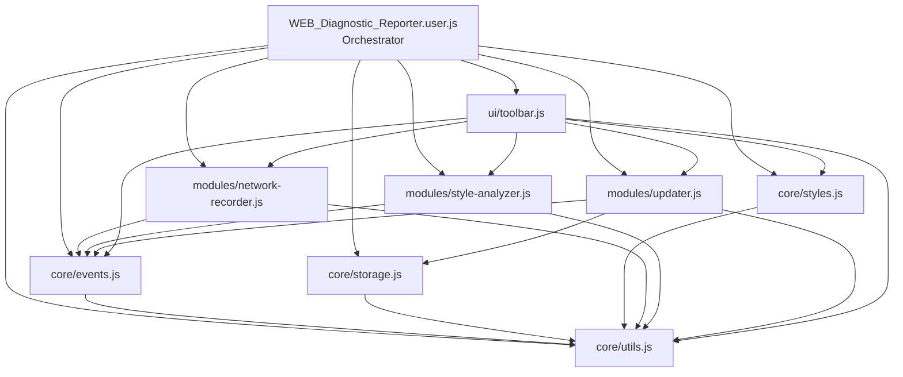
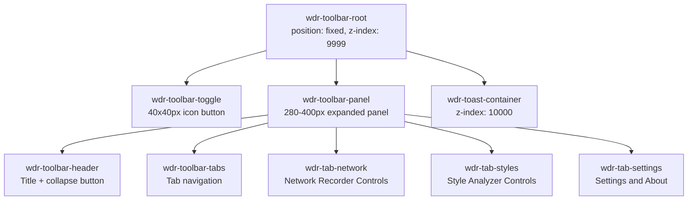
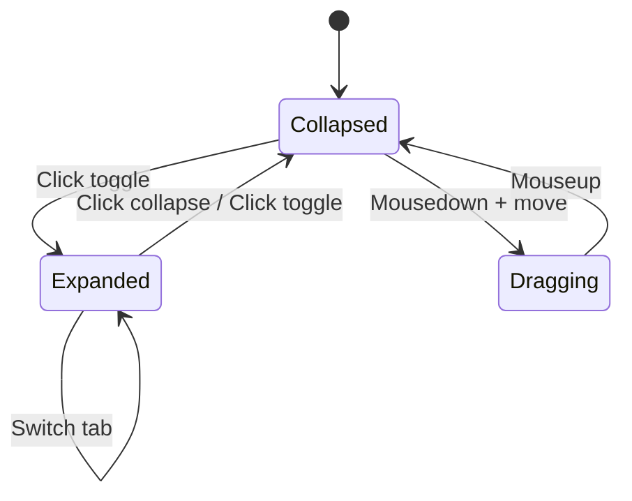
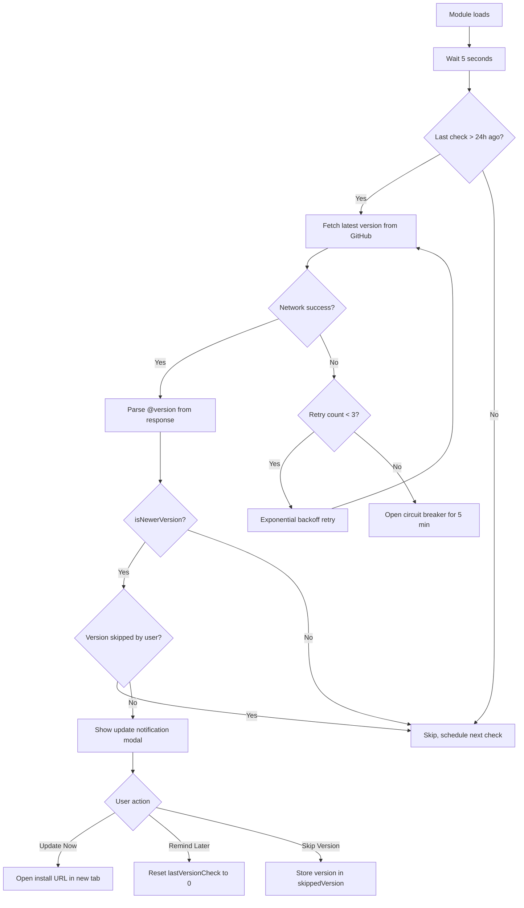
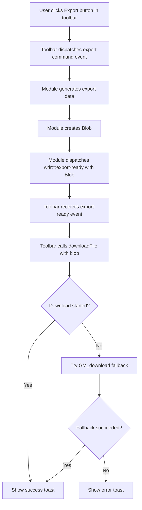

# WEB Diagnostic Reporter — Architecture Document

## Table of Contents

1. [Overview](#overview)
2. [File Structure and Load Order](#file-structure-and-load-order)
3. [Module Dependency Graph](#module-dependency-graph)
4. [Main Script Header](#main-script-header)
5. [Module Specifications](#module-specifications)
   - [core/utils.js](#coreutilsjs)
   - [core/events.js](#coreeventsjs)
   - [core/storage.js](#corestoragesjs)
   - [core/styles.js](#corestylesjs)
   - [modules/network-recorder.js](#modulesnetwork-recorderjs)
   - [modules/style-analyzer.js](#modulesstyle-analyzerjs)
   - [modules/updater.js](#modulesupdaterjs)
   - [ui/toolbar.js](#uitoolbarjs)
6. [Network Request Recorder Design](#network-request-recorder-design)
7. [Style Analyzer Design](#style-analyzer-design)
8. [Toolbar UI Design](#toolbar-ui-design)
9. [Update System Integration](#update-system-integration)
10. [Event Bus Specification](#event-bus-specification)
11. [File Export Strategy](#file-export-strategy)
12. [DOM Element Registry](#dom-element-registry)
13. [Edge Cases and Initialization Sequencing](#edge-cases-and-initialization-sequencing)

---

## Overview

WEB Diagnostic Reporter is a modular Tampermonkey userscript that collects and exports diagnostic information about any website. It runs at `document-start` to capture network activity before page load, then renders a floating toolbar UI once the DOM is available.

**Key architectural decisions:**

- **Multi-file `@require` pattern** — Main script is the orchestrator; each module is a separate IIFE loaded via `@require` from GitHub raw URLs.
- **CustomEvent bus** — All inter-module communication uses `CustomEvent` on `document`. No shared globals.
- **DOM-first initialization** — Network recording starts immediately at `document-start`; UI modules defer until `DOMContentLoaded` or body existence.
- **Dark-mode-only UI** — Strict adherence to the [Anti-AI Style Guide](Anti-AI_Style-Guide.md).

---

## File Structure and Load Order

```
WEB_Diagnostic_Reporter/
├── WEB_Diagnostic_Reporter.user.js    # Main orchestrator script - installed by user
├── core/
│   ├── utils.js                       # Load order: 1 — Shared utility functions
│   ├── events.js                      # Load order: 2 — CustomEvent bus helpers
│   ├── storage.js                     # Load order: 3 — GM_setValue/getValue wrappers
│   └── styles.js                      # Load order: 4 — CSS injection, design tokens
├── modules/
│   ├── network-recorder.js            # Load order: 5 — XHR/fetch/resource interception
│   ├── style-analyzer.js              # Load order: 6 — Computed style analysis
│   └── updater.js                     # Load order: 7 — Auto-update from GitHub
├── ui/
│   └── toolbar.js                     # Load order: 8 — Floating toolbar UI
└── docs/
    ├── architecture.md                # This document
    ├── Anti-AI_Style-Guide.md         # UI design constraints
    ├── multi-tampermonkey-guide.md    # Multi-file pattern reference
    └── Update System Documentation.md # Update system reference
```

### Load Order Rationale

| Order | File | Why This Position |
|-------|------|-------------------|
| 1 | `core/utils.js` | Zero dependencies. Provides logging, ID-check helpers used by everything. |
| 2 | `core/events.js` | Depends on utils. Establishes the event bus that all subsequent modules use. |
| 3 | `core/storage.js` | Depends on utils. Wraps GM storage APIs; used by updater and recorder. |
| 4 | `core/styles.js` | Depends on utils. Injects CSS variables and shared classes into `<head>`. |
| 5 | `modules/network-recorder.js` | Depends on utils, events. Must load early to monkey-patch XHR/fetch before any page scripts run. |
| 6 | `modules/style-analyzer.js` | Depends on utils, events. Analysis is on-demand, so load order is flexible. |
| 7 | `modules/updater.js` | Depends on utils, events, storage. Runs on a 5-second delay after startup. |
| 8 | `ui/toolbar.js` | Depends on everything. Defers rendering until DOM body exists. Loaded last. |

---

## Module Dependency Graph



**Dependency communication is exclusively via CustomEvents** — arrows to modules like `NETREC` from `TOOLBAR` indicate event-based interaction, not import/require relationships. The `@require` load order handles script availability.

---

## Main Script Header

The full Tampermonkey metadata block for `WEB_Diagnostic_Reporter.user.js`:

```javascript
// ==UserScript==
// @name         WEB Diagnostic Reporter
// @namespace    https://github.com/Rynagain/WEB_Diagnostic_Reporter
// @version      0.1.0
// @description  Collects and exports diagnostic info about websites — network requests, styles, accessibility, and more.
// @author       Rynagain
// @match        *://*/*
// @run-at       document-start
// @grant        GM_xmlhttpRequest
// @grant        GM_setValue
// @grant        GM_getValue
// @grant        GM_download
// @grant        GM_info
// @grant        unsafeWindow
// @connect      raw.githubusercontent.com
// @connect      github.com

// --- Core Modules ---
// @require      https://raw.githubusercontent.com/Rynagain/WEB_Diagnostic_Reporter/main/core/utils.js
// @require      https://raw.githubusercontent.com/Rynagain/WEB_Diagnostic_Reporter/main/core/events.js
// @require      https://raw.githubusercontent.com/Rynagain/WEB_Diagnostic_Reporter/main/core/storage.js
// @require      https://raw.githubusercontent.com/Rynagain/WEB_Diagnostic_Reporter/main/core/styles.js

// --- Feature Modules ---
// @require      https://raw.githubusercontent.com/Rynagain/WEB_Diagnostic_Reporter/main/modules/network-recorder.js
// @require      https://raw.githubusercontent.com/Rynagain/WEB_Diagnostic_Reporter/main/modules/style-analyzer.js
// @require      https://raw.githubusercontent.com/Rynagain/WEB_Diagnostic_Reporter/main/modules/updater.js

// --- UI ---
// @require      https://raw.githubusercontent.com/Rynagain/WEB_Diagnostic_Reporter/main/ui/toolbar.js

// --- Update URLs ---
// @updateURL    https://raw.githubusercontent.com/Rynagain/WEB_Diagnostic_Reporter/main/WEB_Diagnostic_Reporter.user.js
// @downloadURL  https://raw.githubusercontent.com/Rynagain/WEB_Diagnostic_Reporter/main/WEB_Diagnostic_Reporter.user.js
// ==/UserScript==
```

### Grant Justifications

| Grant | Purpose |
|-------|---------|
| `GM_xmlhttpRequest` | CORS-free fetch for GitHub update checks |
| `GM_setValue` / `GM_getValue` | Persistent storage for update timestamps, skipped versions, user preferences |
| `GM_download` | Alternative file export mechanism for HAR/JSON reports |
| `GM_info` | Access to script metadata including current version |
| `unsafeWindow` | Required to monkey-patch the page's native `XMLHttpRequest` and `fetch` |
| `@connect raw.githubusercontent.com` | Whitelist for update check requests |
| `@connect github.com` | Whitelist fallback for update redirects |

---

## Module Specifications

### `core/utils.js`

**Purpose:** Shared utility functions used by all other modules. Zero external dependencies.

**Public API** (exposed via CustomEvent `wdr:utils:ready`):

| Function | Signature | Description |
|----------|-----------|-------------|
| `log` | `log(moduleName: string, message: string, ...args)` | Console log with `[ModuleName]` prefix |
| `warn` | `warn(moduleName: string, message: string, ...args)` | Console warn with prefix |
| `error` | `error(moduleName: string, message: string, ...args)` | Console error with prefix |
| `elementExists` | `elementExists(id: string): boolean` | Checks `document.getElementById` safely |
| `createEl` | `createEl(tag: string, attrs: object, children?: Node[]): HTMLElement` | Safe element factory with attribute assignment |
| `generateId` | `generateId(prefix: string): string` | Returns `wdr-{prefix}-{timestamp}` |
| `waitForBody` | `waitForBody(): Promise<HTMLElement>` | Resolves when `document.body` exists |
| `formatBytes` | `formatBytes(bytes: number): string` | Human-readable byte sizes |
| `formatDuration` | `formatDuration(ms: number): string` | Human-readable durations |
| `deepClone` | `deepClone(obj: object): object` | Structured clone wrapper |

**CustomEvents dispatched:**

| Event | Detail | When |
|-------|--------|------|
| `wdr:utils:ready` | `{ version: string }` | After IIFE completes initialization |

**DOM elements created:** None.

**IIFE structure:**
```javascript
(function () {
    'use strict';

    // All functions defined here...
    // Exposed via data attribute on a hidden registry element
    // and announced via CustomEvent

    try { module.exports = { log, warn, error, elementExists, createEl, generateId, waitForBody, formatBytes, formatDuration, deepClone }; } catch (e) {}
})();
```

**Communication pattern:** Utils registers its API on a hidden DOM element `#wdr-module-registry` using `data-*` attributes that encode a JSON-serialized function map. Other modules retrieve this by reading the element. Alternatively, utils places functions on `document.wdrUtils` via `Object.defineProperty` — since the Tampermonkey sandbox runs all `@require` files in the same execution context, this is safe and does not constitute "global variable sharing" in the page scope. The `unsafeWindow` global remains untouched.

> **Implementation note:** Since all `@require` files execute in the same Tampermonkey sandbox scope in sequence, modules CAN directly reference names defined in earlier modules within that sandbox. However, to maintain clean boundaries and testability, each module should verify the presence of dependencies via try/catch and fire ready events. The constraint against "global variable sharing" applies to the **page's** `window` object — the Tampermonkey sandbox scope is an acceptable shared context since it is already isolated.

---

### `core/events.js`

**Purpose:** Thin wrapper around `CustomEvent` providing a consistent event bus API. Enables typed event dispatch/subscription with payload validation.

**Public API:**

| Function | Signature | Description |
|----------|-----------|-------------|
| `dispatch` | `dispatch(eventName: string, detail?: object)` | Creates and dispatches a `CustomEvent` on `document` |
| `on` | `on(eventName: string, handler: Function): Function` | Subscribe to event; returns unsubscribe function |
| `once` | `once(eventName: string, handler: Function)` | Subscribe for a single event firing |
| `off` | `off(eventName: string, handler: Function)` | Unsubscribe handler |

**Event naming convention:** All events use the prefix `wdr:` followed by module name and action:
```
wdr:{module}:{action}
```

Examples: `wdr:network:request-complete`, `wdr:toolbar:panel-opened`, `wdr:updater:update-available`

**CustomEvents dispatched:**

| Event | Detail | When |
|-------|--------|------|
| `wdr:events:ready` | `{ version: string }` | After bus initialization |

**DOM elements created:** None.

---

### `core/storage.js`

**Purpose:** Wraps `GM_setValue` and `GM_getValue` with namespaced keys, default values, and JSON serialization.

**Public API:**

| Function | Signature | Description |
|----------|-----------|-------------|
| `get` | `get(key: string, defaultValue?: any): any` | Retrieve stored value with `wdr_` key prefix |
| `set` | `set(key: string, value: any): void` | Store value with `wdr_` key prefix |
| `remove` | `remove(key: string): void` | Delete stored value |
| `getAll` | `getAll(): object` | Retrieve all wdr-namespaced stored values |

**Storage keys used:**

| Key | Type | Purpose |
|-----|------|---------|
| `wdr_last_version_check` | `number` | Timestamp of last update check |
| `wdr_skipped_version` | `string` | Version user chose to skip |
| `wdr_panel_position` | `{ x, y }` | Saved toolbar position |
| `wdr_recording_enabled` | `boolean` | Whether network recording auto-starts |
| `wdr_preferences` | `object` | User preferences blob |

**CustomEvents dispatched:**

| Event | Detail | When |
|-------|--------|------|
| `wdr:storage:ready` | `{ version: string }` | After initialization |

**DOM elements created:** None.

---

### `core/styles.js`

**Purpose:** Injects all shared CSS into the document. Creates a `<style>` element with CSS custom properties, component classes, and layout utilities. All classes use the `tm-` prefix per the style guide.

**Public API:**

| Function | Signature | Description |
|----------|-----------|-------------|
| `injectStyles` | `injectStyles(): void` | Injects the `<style>` tag if not already present |
| `getToken` | `getToken(name: string): string` | Retrieve a CSS variable value at runtime |

**DOM elements created:**

| Element | ID | Description |
|---------|----|-------------|
| `<style>` | `wdr-global-styles` | Shared CSS variables and component styles |

**CSS variables injected:** All tokens from the [Anti-AI Style Guide](Anti-AI_Style-Guide.md:391) `CSS Variables Template` section, including:
- Background tokens: `--tm-bg-primary` through `--tm-bg-elevated`
- Text tokens: `--tm-text-primary`, `--tm-text-secondary`, `--tm-text-disabled`
- Border tokens: `--tm-border-subtle`, `--tm-border-default`, `--tm-border-strong`
- Accent tokens: `--tm-accent-primary` through `--tm-accent-error`
- Spacing tokens: `--tm-space-1` through `--tm-space-6`
- Typography tokens: `--tm-font-xs` through `--tm-font-lg`
- Transition tokens: `--tm-transition-fast`, `--tm-transition-normal`, `--tm-transition-slow`
- Radius tokens: `--tm-radius-sm`, `--tm-radius-md`, `--tm-radius-lg`

**Component classes injected:** `tm-btn-primary`, `tm-btn-secondary`, `tm-btn-ghost`, `tm-input`, `tm-toggle`, `tm-floating-panel`, `tm-floating-toggle`, `tm-panel-content`, plus focus-visible styles.

**Initialization:** Defers injection until `<head>` exists. Uses `waitForBody` or a `MutationObserver` on `document.documentElement` to detect `<head>` availability.

**CustomEvents dispatched:**

| Event | Detail | When |
|-------|--------|------|
| `wdr:styles:ready` | `{ version: string }` | After style tag injected |

---

### `modules/network-recorder.js`

**Purpose:** Intercepts all `XMLHttpRequest`, `fetch`, and `PerformanceObserver` resource entries to build a comprehensive log of network activity. Must initialize at `document-start` before any page scripts.

See [Network Request Recorder Design](#network-request-recorder-design) for full details.

**Public API:**

| Function | Signature | Description |
|----------|-----------|-------------|
| `startRecording` | `startRecording(): void` | Begin capturing (auto-called on load) |
| `stopRecording` | `stopRecording(): void` | Pause capturing |
| `clearRecords` | `clearRecords(): void` | Wipe all captured entries |
| `getRecords` | `getRecords(): NetworkEntry[]` | Return all captured entries |
| `getRecordCount` | `getRecordCount(): number` | Current entry count |
| `exportAsJSON` | `exportAsJSON(): string` | Serialize records as JSON |
| `exportAsHAR` | `exportAsHAR(): string` | Serialize records as HAR 1.2 |
| `isRecording` | `isRecording(): boolean` | Current recording state |

**CustomEvents dispatched:**

| Event | Detail | When |
|-------|--------|------|
| `wdr:network:ready` | `{ version: string }` | After XHR/fetch patches installed |
| `wdr:network:request-start` | `{ id, url, method, timestamp }` | When a request begins |
| `wdr:network:request-complete` | `{ entry, id, url, method, status, duration, size }` | When a request finishes |
| `wdr:network:request-error` | `{ id, url, method, error }` | When a request fails |
| `wdr:network:recording-started` | `{}` | Recording enabled |
| `wdr:network:recording-stopped` | `{}` | Recording paused |
| `wdr:network:records-cleared` | `{ previousCount }` | Records wiped |
| `wdr:network:count-updated` | `{ count }` | Entry count changed (after add or clear) |
| `wdr:network:export-ready` | `{ format, blob }` | Export file generated |

**CustomEvents listened to:**

| Event | Action |
|-------|--------|
| `wdr:toolbar:network-start` | Calls `startRecording()` |
| `wdr:toolbar:network-stop` | Calls `stopRecording()` |
| `wdr:toolbar:network-clear` | Calls `clearRecords()` |
| `wdr:toolbar:network-export-json` | Calls `exportAsJSON()`, dispatches `wdr:network:export-ready` |
| `wdr:toolbar:network-export-har` | Calls `exportAsHAR()`, dispatches `wdr:network:export-ready` |

**DOM elements created:** None (headless module).

---

### `modules/style-analyzer.js`

**Purpose:** Analyzes the computed styles, fonts, colors, layout patterns, and accessibility metrics of the current page on demand.

See [Style Analyzer Design](#style-analyzer-design) for full details.

**Public API:**

| Function | Signature | Description |
|----------|-----------|-------------|
| `runAnalysis` | `runAnalysis(): AnalysisReport` | Execute full-page analysis |
| `analyzeElement` | `analyzeElement(el: HTMLElement): ElementReport` | Analyze a single element |
| `getLastReport` | `getLastReport(): AnalysisReport` | Retrieve most recent analysis |
| `exportReport` | `exportReport(): string` | Serialize report as JSON |

**CustomEvents dispatched:**

| Event | Detail | When |
|-------|--------|------|
| `wdr:styles-analyzer:ready` | `{ version: string }` | After module initialization |
| `wdr:styles-analyzer:analysis-start` | `{}` | When analysis begins |
| `wdr:styles-analyzer:analysis-complete` | `{ report: AnalysisReport }` | When analysis finishes |
| `wdr:styles-analyzer:export-ready` | `{ format, blob }` | Export file generated |

**CustomEvents listened to:**

| Event | Action |
|-------|--------|
| `wdr:toolbar:run-analysis` | Calls `runAnalysis()` |
| `wdr:toolbar:export-analysis` | Calls `exportReport()`, dispatches export-ready |

**DOM elements created:** None (headless module).

---

### `modules/updater.js`

**Purpose:** Checks GitHub for newer versions and presents an update notification modal.

See [Update System Integration](#update-system-integration) for full details.

**Public API:**

| Function | Signature | Description |
|----------|-----------|-------------|
| `checkForUpdates` | `checkForUpdates(manual?: boolean): void` | Trigger a version check |
| `getCurrentVersion` | `getCurrentVersion(): string` | Return current script version |

**CustomEvents dispatched:**

| Event | Detail | When |
|-------|--------|------|
| `wdr:updater:ready` | `{ version: string }` | After initialization |
| `wdr:updater:check-start` | `{}` | Update check begins |
| `wdr:updater:update-available` | `{ currentVersion, latestVersion }` | Newer version found |
| `wdr:updater:up-to-date` | `{ version }` | Already on latest |
| `wdr:updater:check-failed` | `{ error, attempt }` | Check failed |

**CustomEvents listened to:**

| Event | Action |
|-------|--------|
| `wdr:toolbar:check-updates` | Calls `checkForUpdates(true)` |

**DOM elements created:**

| Element | ID | Description |
|---------|----|-------------|
| `<div>` | `wdr-update-modal-overlay` | Full-screen overlay for update notification |
| `<div>` | `wdr-update-modal` | The modal dialog itself |

---

### `ui/toolbar.js`

**Purpose:** Renders the floating toolbar UI — a collapsed icon button that expands into a tabbed panel with controls for network recording and style analysis.

See [Toolbar UI Design](#toolbar-ui-design) for full details.

**Public API:**

| Function | Signature | Description |
|----------|-----------|-------------|
| `show` | `show(): void` | Make toolbar visible |
| `hide` | `hide(): void` | Hide toolbar |
| `expand` | `expand(): void` | Open the panel |
| `collapse` | `collapse(): void` | Close to icon-only |
| `setActiveTab` | `setActiveTab(tabId: string): void` | Switch active tab |

**CustomEvents dispatched:**

| Event | Detail | When |
|-------|--------|------|
| `wdr:toolbar:ready` | `{ version: string }` | After toolbar rendered |
| `wdr:toolbar:panel-opened` | `{}` | Panel expanded |
| `wdr:toolbar:panel-closed` | `{}` | Panel collapsed |
| `wdr:toolbar:network-start` | `{}` | User clicks start recording |
| `wdr:toolbar:network-stop` | `{}` | User clicks stop recording |
| `wdr:toolbar:network-clear` | `{}` | User clicks clear records |
| `wdr:toolbar:network-export-json` | `{}` | User clicks export JSON |
| `wdr:toolbar:network-export-har` | `{}` | User clicks export HAR |
| `wdr:toolbar:run-analysis` | `{}` | User clicks run style analysis |
| `wdr:toolbar:export-analysis` | `{}` | User clicks export analysis |
| `wdr:toolbar:check-updates` | `{}` | User clicks check for updates |

**CustomEvents listened to:**

| Event | Action |
|-------|--------|
| `wdr:network:request-complete` | Update request counter badge |
| `wdr:network:recording-started` | Toggle recording button state to active |
| `wdr:network:recording-stopped` | Toggle recording button state to inactive |
| `wdr:network:records-cleared` | Reset counter badge |
| `wdr:network:export-ready` | Trigger file download |
| `wdr:styles-analyzer:analysis-start` | Show loading spinner in analysis tab |
| `wdr:styles-analyzer:analysis-complete` | Render analysis results in panel |
| `wdr:styles-analyzer:export-ready` | Trigger file download |
| `wdr:updater:update-available` | Show notification indicator |
| `wdr:updater:up-to-date` | Show toast confirmation |
| `wdr:updater:check-failed` | Show toast error |

**DOM elements created:**

| Element | ID | Description |
|---------|----|-------------|
| `<div>` | `wdr-toolbar-root` | Root container for entire toolbar |
| `<button>` | `wdr-toolbar-toggle` | 40x40px collapsed toggle button |
| `<div>` | `wdr-toolbar-panel` | Expanded panel container |
| `<div>` | `wdr-toolbar-header` | Panel header with title and close |
| `<div>` | `wdr-toolbar-tabs` | Tab navigation bar |
| `<div>` | `wdr-tab-network` | Network recorder tab content |
| `<div>` | `wdr-tab-styles` | Style analyzer tab content |
| `<div>` | `wdr-tab-settings` | Settings/about tab content |
| `<div>` | `wdr-toast-container` | Toast notification container |

---

## Network Request Recorder Design

### Interception Strategy

The network recorder must capture requests that originate **before** the page's own scripts execute. Since the userscript runs at `document-start`, the monkey-patching happens before the page loads.

**Critical design decision:** We use **prototype patching** rather than constructor replacement for XHR interception. This follows the proven pattern from [Network Token Scanning Performance](Network%20Token%20Scanning%20Performance.md). Prototype patching is more reliable because:
- It works even when page scripts cache `XMLHttpRequest` before the patch
- It avoids Tampermonkey sandbox boundary issues with constructor assignment
- It doesn't break `instanceof` checks
- It modifies the existing prototype so all current and future instances are affected

#### 1. XMLHttpRequest Prototype Patching

Patch three methods on `unsafeWindow.XMLHttpRequest.prototype`:

```javascript
// Store originals
var _origOpen = targetWindow.XMLHttpRequest.prototype.open;
var _origSetRequestHeader = targetWindow.XMLHttpRequest.prototype.setRequestHeader;
var _origSend = targetWindow.XMLHttpRequest.prototype.send;

// Patch open() — capture method and URL, attach per-instance _wdr tracker
targetWindow.XMLHttpRequest.prototype.open = function (method, url, async, user, password) {
    this._wdr = { id, method, url, async, requestHeaders: {}, requestBody: null, startTime: 0, listenerAttached: false };
    return _origOpen.apply(this, arguments);
};

// Patch setRequestHeader() — capture each header as it is set
targetWindow.XMLHttpRequest.prototype.setRequestHeader = function (name, value) {
    if (this._wdr) { this._wdr.requestHeaders[name] = value; }
    return _origSetRequestHeader.apply(this, arguments);
};

// Patch send() — capture body, start timing, attach loadend listener
targetWindow.XMLHttpRequest.prototype.send = function (body) {
    if (this._wdr && !this._wdr.listenerAttached) {
        this._wdr.requestBody = truncateBody(body);
        this._wdr.startTime = performance.now();
        this._wdr.listenerAttached = true;
        this.addEventListener('loadend', function () { /* capture response details */ });
    }
    return _origSend.apply(this, arguments);
};
```

Per-instance state is stored on a `_wdr` property attached during `open()`. The `loadend` event fires for all terminal states (load, error, abort, timeout).

#### 2. Fetch Proxy

Fetch is a standalone function (not a constructor with a prototype), so the wrapper approach is the correct pattern:

```
unsafeWindow.fetch = wrappedFetch
```

The wrapper:
- Extracts method, URL, headers, body from both `fetch(url, init)` and `fetch(Request)` signatures
- Calls the original `fetch` and wraps the returned `Promise`
- On resolve: reads `Response` status, headers, `Content-Length`; clones the response to read body size without consuming the stream
- On reject: captures the error
- Records timing via `performance.now()` deltas

#### 3. PerformanceObserver for Resource Timing

For requests not initiated by JavaScript — images, stylesheets, scripts, fonts — use `PerformanceObserver`:

```javascript
const perfObserver = new PerformanceObserver(list => {
    for (const entry of list.getEntries()) {
        // entry.name = URL
        // entry.initiatorType = 'img' | 'script' | 'css' | 'link' | etc.
        // entry.startTime, entry.responseEnd, entry.transferSize, etc.
    }
});
perfObserver.observe({ type: 'resource', buffered: true });
```

The `buffered: true` option captures resources that loaded before the observer was created.

Resource entries with `initiatorType` of `'xmlhttprequest'` or `'fetch'` are used to **enrich** existing XHR/fetch entries with `transferSize` data rather than creating duplicates. All other resource types are added as `type: 'resource'` entries directly to the main entries array.

#### 4. Navigation Timing

Capture the page navigation itself via `performance.getEntriesByType('navigation')` to record the initial document request. Deferred until `window.load` event with a small delay to ensure the navigation entry is finalized.

#### 5. navigator.sendBeacon Proxy

`navigator.sendBeacon` is commonly used by analytics libraries for fire-and-forget data submissions. It's patched using prototype patching on `Navigator.prototype.sendBeacon` (same reliable approach as XHR):

```javascript
var _origSendBeacon = Navigator.prototype.sendBeacon;
Navigator.prototype.sendBeacon = function (url, data) {
    // Capture as a 'beacon' type entry with method POST
    // sendBeacon is fire-and-forget: no response is available
    _addEntry({ type: 'beacon', method: 'POST', url, ... });
    return _origSendBeacon.apply(this, arguments);
};
```

Since `sendBeacon` returns only a boolean and provides no response data, these entries have `status: 0` and no response headers/size.

#### 6. Re-patch Detection

A `setInterval` (every 5 seconds) checks whether `XMLHttpRequest.prototype.open`, `fetch`, or `Navigator.prototype.sendBeacon` have been overwritten by page scripts. If so, the recorder re-applies its patches by chaining through whatever was installed, preserving both the page's overrides and WDR's interception.

### Internal Data Model — `NetworkEntry`

```typescript
interface NetworkEntry {
    id: string;                    // Unique ID: wdr_{timestamp}_{counter}_{random}
    type: 'xhr' | 'fetch' | 'resource' | 'navigation' | 'beacon';
    url: string;
    method: string;                // GET, POST, etc. - 'GET' default for resources
    requestHeaders: object;        // { headerName: value } - XHR/fetch only
    requestBody: string | null;    // XHR/fetch only, truncated at 10KB
    status: number;
    statusText: string;
    responseHeaders: object;       // { headerName: value }
    responseSize: number;          // Bytes (decodedBodySize for resources)
    transferSize: number;          // From PerformanceEntry if available, 0 otherwise
    mimeType: string;
    startTime: number;             // performance.now() or PerformanceEntry.startTime
    endTime: number;
    duration: number;              // endTime - startTime in ms
    initiatorType: string;         // 'xmlhttprequest' | 'fetch' | 'img' | 'script' | 'navigation' | etc.
    error: string | null;          // Error message if failed
    timestamp: string;             // ISO 8601 wall-clock time
}
```

> **Note:** Headers are stored as plain objects (`{ name: value }`) rather than arrays of `{name, value}` pairs. The HAR export converts these to the array format required by the HAR 1.2 spec.

### HAR 1.2 Export Format

The export maps `NetworkEntry[]` to the HAR 1.2 specification:

```
HAR
├── log
│   ├── version: '1.2'
│   ├── creator: { name: 'WEB Diagnostic Reporter', version: '0.1.0' }
│   ├── pages: [{ startedDateTime, id, title, pageTimings }]
│   └── entries: [
│       {
│           startedDateTime,
│           time,
│           request: { method, url, httpVersion, headers, queryString, bodySize },
│           response: { status, statusText, httpVersion, headers, content: { size, mimeType }, bodySize },
│           cache: {},
│           timings: { send, wait, receive }
│       }
│   ]
```

**Timing mapping:**
- `send`: 0 (not measurable from userscript)
- `wait`: `responseStart - startTime` if PerformanceEntry available, else `duration * 0.8`
- `receive`: `responseEnd - responseStart` if available, else `duration * 0.2`

### Memory Management

- Maximum record count: **5000 entries** (configurable). Oldest entries are dropped when the limit is reached (ring buffer behavior).
- Request/response bodies are truncated to **10KB** to prevent memory exhaustion.
- Periodic `getRecordCount()` dispatches enable the UI to show warnings when approaching the limit.

---

## Style Analyzer Design

### Analysis Scope

The analyzer traverses all visible elements in the DOM and aggregates style information into a structured report.

### Properties Analyzed

#### Typography
- Font families in use (with frequency count)
- Font sizes in use (with frequency count)
- Font weights in use
- Line heights
- Letter spacing values

#### Colors
- Background colors (with frequency count)
- Text colors (with frequency count)
- Border colors
- Unique color palette extraction
- Color contrast ratios (text color vs. background)

#### Layout
- Display property distribution (`block`, `flex`, `grid`, `inline`, etc.)
- Position property distribution (`static`, `relative`, `absolute`, `fixed`, `sticky`)
- Box model statistics (padding/margin ranges)
- Z-index values in use
- Overflow property usage

#### Spacing
- Margin values (with distribution)
- Padding values (with distribution)
- Gap values (for flex/grid containers)

#### Accessibility Metrics
- Elements without alt text (images)
- Contrast ratio violations (below 4.5:1 for normal text, below 3:1 for large text)
- Interactive elements below 40x40px touch target
- Missing ARIA labels on interactive elements
- Heading hierarchy validation (h1-h6 order)
- Tab index usage

#### Design Consistency Scores
- Number of unique font families (fewer = more consistent)
- Number of unique font sizes
- Number of unique colors
- Spacing value variance

### DOM Traversal Strategy

```javascript
function traverseVisibleElements(root) {
    const walker = document.createTreeWalker(
        root,
        NodeFilter.SHOW_ELEMENT,
        {
            acceptNode: function(node) {
                const style = window.getComputedStyle(node);
                if (style.display === 'none' || style.visibility === 'hidden') {
                    return NodeFilter.FILTER_REJECT; // Skip node and children
                }
                // Skip our own toolbar elements
                if (node.id && node.id.startsWith('wdr-')) {
                    return NodeFilter.FILTER_REJECT;
                }
                return NodeFilter.FILTER_ACCEPT;
            }
        }
    );
    // Iterate walker...
}
```

**Performance considerations:**
- Use `requestIdleCallback` to avoid blocking the main thread
- Process elements in batches of 100
- Cache `getComputedStyle` results per element
- Skip elements inside `wdr-*` containers to avoid analyzing our own UI
- Dispatch progress events for long analyses

### Report Structure — `AnalysisReport`

```typescript
interface AnalysisReport {
    metadata: {
        url: string;
        title: string;
        timestamp: string;           // ISO 8601
        elementCount: number;
        analysisTime: number;         // ms
        version: string;
    };
    typography: {
        fonts: { value: string; count: number }[];
        sizes: { value: string; count: number }[];
        weights: { value: string; count: number }[];
        lineHeights: { value: string; count: number }[];
    };
    colors: {
        backgrounds: { value: string; count: number }[];
        textColors: { value: string; count: number }[];
        borderColors: { value: string; count: number }[];
        palette: string[];           // Deduplicated unique colors
    };
    layout: {
        displayTypes: { value: string; count: number }[];
        positionTypes: { value: string; count: number }[];
        zIndices: { value: string; count: number }[];
    };
    spacing: {
        margins: { value: string; count: number }[];
        paddings: { value: string; count: number }[];
    };
    accessibility: {
        score: number;               // 0-100
        issues: AccessibilityIssue[];
        summary: {
            imagesWithoutAlt: number;
            contrastViolations: number;
            smallTouchTargets: number;
            missingAriaLabels: number;
            headingOrderViolations: number;
        };
    };
    consistency: {
        score: number;               // 0-100
        uniqueFonts: number;
        uniqueSizes: number;
        uniqueColors: number;
        spacingVariance: number;
    };
}

interface AccessibilityIssue {
    type: 'contrast' | 'alt-text' | 'touch-target' | 'aria-label' | 'heading-order';
    severity: 'error' | 'warning';
    element: string;                 // CSS selector path
    message: string;
    details: object;
}
```

---

## Toolbar UI Design

### Component Hierarchy



### Panel States



**Collapsed state:**
- Single 40x40px button with inline SVG icon (diagnostic/wrench icon from Lucide)
- Background: `#1a1a1a`, border: `1px solid #303030`, border-radius: `8px`
- Position: fixed, bottom-right corner default, draggable
- Cursor: `grab` (idle), `grabbing` (dragging)

**Expanded state:**
- Panel appears anchored to the toggle button position
- Width: `320px` (within 280-400px range)
- Max height: `80vh`, scrollable content area
- Animation: width/height expand over `150ms ease-out`
- Header shows title "WEB Diagnostic Reporter" + version + collapse button

### Tab System

Three tabs in the tab bar:

| Tab | Icon | Label | Content |
|-----|------|-------|---------|
| Network | Activity icon (Lucide) | Network | Recording controls, request counter, export buttons |
| Styles | Palette icon (Lucide) | Styles | Run analysis button, results summary, export button |
| Settings | Settings icon (Lucide) | Settings | Version info, update check, preferences, about |

**Tab bar styling:**
- Horizontal row of tab buttons
- Active tab: `--tm-accent-primary` bottom border (2px), `--tm-text-primary` text
- Inactive tab: no bottom border, `--tm-text-secondary` text
- Tab button minimum touch target: 40px height

### Network Tab Content

```
┌─────────────────────────────────────┐
│  [Record] [Stop] [Clear]            │
│                                     │
│  Requests: 47        Status: ● REC  │
│                                     │
│  ┌─────────────────────────────────┐│
│  │ Recent Requests (scrollable)    ││
│  │ GET /api/users      200  45ms  ││
│  │ POST /api/data      201  120ms ││
│  │ GET /styles.css     200  12ms  ││
│  │ ...                             ││
│  └─────────────────────────────────┘│
│                                     │
│  [Export JSON]  [Export HAR]        │
└─────────────────────────────────────┘
```

- **Record/Stop** toggle button — changes icon and label based on state
- **Clear** button — ghost style, clears all recorded requests
- **Request counter** — updates in real-time via `wdr:network:request-complete` events
- **Status indicator** — small circle: `--tm-accent-error` when recording, `--tm-text-disabled` when stopped
- **Recent requests list** — scrollable, shows last 20 entries with method, path, status, duration
- **Export buttons** — primary and secondary style, at bottom

### Styles Tab Content

```
┌─────────────────────────────────────┐
│  [Run Analysis]                     │
│                                     │
│  ┌─ Summary ──────────────────────┐ │
│  │ Elements analyzed: 342         │ │
│  │ Unique fonts: 3                │ │
│  │ Unique colors: 24              │ │
│  │ Consistency score: 78/100      │ │
│  │ Accessibility score: 65/100    │ │
│  └────────────────────────────────┘ │
│                                     │
│  ┌─ Issues ───────────────────────┐ │
│  │ 4 contrast violations          │ │
│  │ 2 missing alt texts            │ │
│  │ 1 small touch target           │ │
│  └────────────────────────────────┘ │
│                                     │
│  [Export Report]                    │
└─────────────────────────────────────┘
```

- **Run Analysis** button — primary style, triggers full page analysis
- **Loading state** — replaces summary with a simple spinner animation (CSS-only, no bounce) during analysis
- **Summary cards** — key metrics displayed in a compact grid
- **Issues list** — collapsible section showing accessibility/consistency issues
- **Export Report** button — secondary style

### Settings Tab Content

```
┌─────────────────────────────────────┐
│  WEB Diagnostic Reporter v0.1.0     │
│                                     │
│  ┌─ Preferences ──────────────────┐ │
│  │ Auto-record on load  [toggle]  │ │
│  │ Max records: [input: 5000]     │ │
│  └────────────────────────────────┘ │
│                                     │
│  ┌─ Updates ──────────────────────┐ │
│  │ Current: 0.1.0                 │ │
│  │ Last checked: 2 hours ago      │ │
│  │ [Check for Updates]            │ │
│  └────────────────────────────────┘ │
│                                     │
│  github.com/Rynagain/WEB_Diag...   │
└─────────────────────────────────────┘
```

### Drag Behavior

The collapsed toggle button is draggable:
1. `mousedown` on toggle sets `dragging = true`, records offset
2. `mousemove` on `document` updates position (constrained to viewport)
3. `mouseup` sets `dragging = false`, saves position via `wdr:storage`
4. Short click (no movement) toggles panel expand/collapse
5. Panel anchors to whichever edge the toggle is nearest to (left/right)

### Toast Notifications

Toasts appear in `wdr-toast-container` (z-index: `10000`), positioned top-right:
- Auto-dismiss after 4 seconds
- Slide-in animation: `150ms ease-out`
- Types: `success` (green left border), `error` (red left border), `info` (blue left border)
- Background: `--tm-bg-elevated`, text: `--tm-text-primary`
- Max 3 toasts visible; older ones are removed

---

## Update System Integration

### Architecture

The updater module integrates as a standard IIFE module following the same pattern as all others. It uses `GM_xmlhttpRequest` (granted in the main script header) to bypass CORS when fetching from GitHub.

### Configuration

```javascript
const UPDATE_CONFIG = {
    currentVersion: GM_info.script.version,  // Reads from @version in metadata
    githubRawUrl: 'https://raw.githubusercontent.com/Rynagain/WEB_Diagnostic_Reporter/main/WEB_Diagnostic_Reporter.user.js',
    checkInterval: 24 * 60 * 60 * 1000,     // 24 hours
    startupDelay: 5000,                       // 5 seconds
    maxRetries: 3,
    circuitBreakerTimeout: 5 * 60 * 1000,    // 5 minutes
    circuitBreakerThreshold: 3                // failures before opening
};
```

### Startup Sequence



### Version Comparison

Uses the `isNewerVersion(latest, current)` algorithm from the [Update System Documentation](Update%20System%20Documentation.md:125):
- Split both versions on `.`
- Parse each part as integer
- Pad to equal length with `0`
- Compare left to right; first difference determines result

### Update Notification Modal

The modal follows the [Anti-AI Style Guide](Anti-AI_Style-Guide.md) constraints:
- Overlay: `position: fixed`, full viewport, `background: rgba(0, 0, 0, 0.5)`, z-index: `9995`
- Modal: `background: --tm-bg-elevated`, `border: 1px solid --tm-border-default`, `border-radius: 8px`
- Title: "Update Available" in `--tm-font-lg`, `--tm-text-primary`
- Version comparison: "Current: x.y.z / Latest: a.b.c" in `--tm-font-base`, `--tm-text-secondary`
- Three buttons:
  - **Update Now** — `tm-btn-primary`
  - **Remind Later** — `tm-btn-secondary`
  - **Skip This Version** — `tm-btn-ghost`
- Close on Escape key
- Focus trap within modal

### Retry and Circuit Breaker

```
Attempt 1: immediate
Attempt 2: 1000ms delay  (1s * 2^0)
Attempt 3: 2000ms delay  (1s * 2^1)
Circuit opens: 5 minute cooldown after 3 consecutive failures
Circuit resets: on next successful check or after cooldown expires
```

---

## Event Bus Specification

All inter-module communication uses `CustomEvent` dispatched on `document`. Events follow the naming convention `wdr:{module}:{action}`.

### Complete Event Catalog

#### Core Events

| Event Name | Source | Detail Payload | Consumers |
|------------|--------|----------------|-----------|
| `wdr:utils:ready` | utils.js | `{ version: string }` | All modules |
| `wdr:events:ready` | events.js | `{ version: string }` | All modules |
| `wdr:storage:ready` | storage.js | `{ version: string }` | updater, toolbar |
| `wdr:styles:ready` | styles.js | `{ version: string }` | toolbar |

#### Network Recorder Events

| Event Name | Source | Detail Payload | Consumers |
|------------|--------|----------------|-----------|
| `wdr:network:ready` | network-recorder.js | `{ version: string }` | toolbar |
| `wdr:network:request-start` | network-recorder.js | `{ id: string, url: string, method: string, timestamp: string }` | toolbar |
| `wdr:network:request-complete` | network-recorder.js | `{ id: string, url: string, method: string, status: number, duration: number, size: number }` | toolbar |
| `wdr:network:request-error` | network-recorder.js | `{ id: string, url: string, method: string, error: string }` | toolbar |
| `wdr:network:recording-started` | network-recorder.js | `{}` | toolbar |
| `wdr:network:recording-stopped` | network-recorder.js | `{}` | toolbar |
| `wdr:network:records-cleared` | network-recorder.js | `{ previousCount: number }` | toolbar |
| `wdr:network:count-updated` | network-recorder.js | `{ count: number }` | toolbar |
| `wdr:network:export-ready` | network-recorder.js | `{ format: 'json' or 'har', blob: Blob }` | toolbar |

#### Style Analyzer Events

| Event Name | Source | Detail Payload | Consumers |
|------------|--------|----------------|-----------|
| `wdr:styles-analyzer:ready` | style-analyzer.js | `{ version: string }` | toolbar |
| `wdr:styles-analyzer:analysis-start` | style-analyzer.js | `{}` | toolbar |
| `wdr:styles-analyzer:analysis-complete` | style-analyzer.js | `{ report: AnalysisReport }` | toolbar |
| `wdr:styles-analyzer:export-ready` | style-analyzer.js | `{ format: 'json', blob: Blob }` | toolbar |

#### Updater Events

| Event Name | Source | Detail Payload | Consumers |
|------------|--------|----------------|-----------|
| `wdr:updater:ready` | updater.js | `{ version: string }` | toolbar |
| `wdr:updater:check-start` | updater.js | `{}` | toolbar |
| `wdr:updater:update-available` | updater.js | `{ currentVersion: string, latestVersion: string }` | toolbar |
| `wdr:updater:up-to-date` | updater.js | `{ version: string }` | toolbar |
| `wdr:updater:check-failed` | updater.js | `{ error: string, attempt: number }` | toolbar |

#### Toolbar Command Events

| Event Name | Source | Detail Payload | Consumers |
|------------|--------|----------------|-----------|
| `wdr:toolbar:ready` | toolbar.js | `{ version: string }` | main script |
| `wdr:toolbar:panel-opened` | toolbar.js | `{}` | — |
| `wdr:toolbar:panel-closed` | toolbar.js | `{}` | — |
| `wdr:toolbar:network-start` | toolbar.js | `{}` | network-recorder |
| `wdr:toolbar:network-stop` | toolbar.js | `{}` | network-recorder |
| `wdr:toolbar:network-clear` | toolbar.js | `{}` | network-recorder |
| `wdr:toolbar:network-export-json` | toolbar.js | `{}` | network-recorder |
| `wdr:toolbar:network-export-har` | toolbar.js | `{}` | network-recorder |
| `wdr:toolbar:run-analysis` | toolbar.js | `{}` | style-analyzer |
| `wdr:toolbar:export-analysis` | toolbar.js | `{}` | style-analyzer |
| `wdr:toolbar:check-updates` | toolbar.js | `{}` | updater |

---

## File Export Strategy

### Primary Method: Blob + Object URL + Click

This is the default export mechanism that works in all browsers without special permissions:

```javascript
function downloadFile(filename, content, mimeType) {
    const blob = new Blob([content], { type: mimeType });
    const url = URL.createObjectURL(blob);
    const a = document.createElement('a');
    a.href = url;
    a.download = filename;
    a.style.display = 'none';
    document.body.appendChild(a);
    a.click();

    // Cleanup
    setTimeout(() => {
        URL.revokeObjectURL(url);
        a.remove();
    }, 100);
}
```

### Fallback Method: GM_download

If `GM_download` is available and the primary method fails (e.g., some browsers block programmatic clicks on download links):

```javascript
function downloadFileGM(filename, content, mimeType) {
    const blob = new Blob([content], { type: mimeType });
    const url = URL.createObjectURL(blob);
    GM_download({
        url: url,
        name: filename,
        onerror: function(err) {
            console.error('[Export] GM_download failed:', err);
        },
        onload: function() {
            URL.revokeObjectURL(url);
        }
    });
}
```

### File Naming Convention

```
{type}_{hostname}_{timestamp}.{ext}
```

Examples:
- `network_example-com_2026-02-15T070000Z.har`
- `network_example-com_2026-02-15T070000Z.json`
- `styles_example-com_2026-02-15T070000Z.json`

### MIME Types

| Export | MIME Type | Extension |
|--------|-----------|-----------|
| Network JSON | `application/json` | `.json` |
| Network HAR | `application/json` | `.har` |
| Style Analysis | `application/json` | `.json` |

### Export Flow



---

## DOM Element Registry

All DOM elements created by the script use the `wdr-` prefix to avoid conflicts with page elements. Complete registry:

| ID | Module | Element | Lifecycle |
|----|--------|---------|-----------|
| `wdr-global-styles` | styles.js | `<style>` | Created once, never removed |
| `wdr-toolbar-root` | toolbar.js | `<div>` | Created on DOM ready, persistent |
| `wdr-toolbar-toggle` | toolbar.js | `<button>` | Inside root, persistent |
| `wdr-toolbar-panel` | toolbar.js | `<div>` | Inside root, show/hide via display |
| `wdr-toolbar-header` | toolbar.js | `<div>` | Inside panel, persistent |
| `wdr-toolbar-tabs` | toolbar.js | `<div>` | Inside panel, persistent |
| `wdr-tab-network` | toolbar.js | `<div>` | Inside panel, show/hide per tab |
| `wdr-tab-styles` | toolbar.js | `<div>` | Inside panel, show/hide per tab |
| `wdr-tab-settings` | toolbar.js | `<div>` | Inside panel, show/hide per tab |
| `wdr-toast-container` | toolbar.js | `<div>` | Inside root, persistent |
| `wdr-update-modal-overlay` | updater.js | `<div>` | Created on demand, removed after action |
| `wdr-update-modal` | updater.js | `<div>` | Inside overlay, removed with overlay |

**Duplicate prevention rule:** Every module must call `document.getElementById(id)` before creating any element. If the element exists, skip creation.

---

## Edge Cases and Initialization Sequencing

### Problem: Network recording must start before document load

**Solution:** The script uses `@run-at document-start`. The network recorder IIFE executes immediately and patches `unsafeWindow.XMLHttpRequest` and `unsafeWindow.fetch` before the page's `<head>` is even parsed. No DOM access is needed for the patching — it operates purely on the `unsafeWindow` object.

### Problem: UI cannot render until DOM body exists

**Solution:** The toolbar module uses `waitForBody()` from utils, which returns a `Promise` that resolves when `document.body` is available:

```javascript
function waitForBody() {
    return new Promise(resolve => {
        if (document.body) {
            resolve(document.body);
            return;
        }
        const observer = new MutationObserver(() => {
            if (document.body) {
                observer.disconnect();
                resolve(document.body);
            }
        });
        observer.observe(document.documentElement, { childList: true });
    });
}
```

### Problem: Style injection needs `<head>` to exist

**Solution:** `core/styles.js` uses a similar observer pattern to wait for `document.head` before injecting the `<style>` tag. At `document-start`, `<head>` may not exist yet.

### Problem: Modules load in sequence but some events may fire before listeners are registered

**Solution:** Each module dispatches a `wdr:{module}:ready` event. Modules that depend on others listen for the ready event with a fallback check — if they load after the dependency already fired its ready event, they check a DOM data attribute `data-wdr-{module}-ready="true"` on `document.documentElement` which each module sets alongside its ready event.

```javascript
// In the dependency module (e.g., network-recorder.js):
document.documentElement.setAttribute('data-wdr-network-ready', 'true');
dispatch('wdr:network:ready', { version: '0.1.0' });

// In the consuming module (e.g., toolbar.js):
if (document.documentElement.getAttribute('data-wdr-network-ready') === 'true') {
    initNetworkTab();
} else {
    on('wdr:network:ready', () => initNetworkTab());
}
```

### Problem: SPA navigation may destroy and recreate DOM

**Solution:** The toolbar module uses a `MutationObserver` on `document.body` to detect if `wdr-toolbar-root` is removed and re-creates it. This follows the standard pattern from the [multi-tampermonkey guide](multi-tampermonkey-guide.md:173).

### Problem: Multiple Tampermonkey script instances

**Solution:** All element creation checks `document.getElementById()` first. If elements already exist, the module attaches to existing elements rather than creating duplicates.

### Problem: Page overrides XMLHttpRequest or fetch after our patch

**Solution:** The network recorder stores references to its patched prototype methods and fetch function. A `setInterval` (every 5 seconds) checks whether `XMLHttpRequest.prototype.open` or `fetch` have been reassigned. If so, the recorder re-applies its patches by chaining through whatever the page installed, preserving both the page's overrides and WDR's interception.

---

## Main Script Body

The main orchestrator script (`WEB_Diagnostic_Reporter.user.js`) has a minimal body since all logic is in modules:

```javascript
(function () {
    'use strict';

    console.log('[WDR] WEB Diagnostic Reporter starting...');
    console.log('[WDR] Version:', GM_info.script.version);
    console.log('[WDR] URL:', window.location.href);

    // All modules are loaded via @require and self-initialize.
    // The main script simply logs startup and listens for readiness.

    let modulesReady = 0;
    const TOTAL_MODULES = 8;

    document.addEventListener('wdr:utils:ready', () => modulesReady++);
    document.addEventListener('wdr:events:ready', () => modulesReady++);
    document.addEventListener('wdr:storage:ready', () => modulesReady++);
    document.addEventListener('wdr:styles:ready', () => modulesReady++);
    document.addEventListener('wdr:network:ready', () => modulesReady++);
    document.addEventListener('wdr:styles-analyzer:ready', () => modulesReady++);
    document.addEventListener('wdr:updater:ready', () => modulesReady++);
    document.addEventListener('wdr:toolbar:ready', () => {
        modulesReady++;
        console.log('[WDR] All modules loaded. Ready.');
    });
})();
```

---

*This architecture document is the authoritative reference for the WEB Diagnostic Reporter project. All implementation must conform to the constraints defined in [Anti-AI_Style-Guide.md](Anti-AI_Style-Guide.md), [multi-tampermonkey-guide.md](multi-tampermonkey-guide.md), and [Update System Documentation.md](Update%20System%20Documentation.md).*
